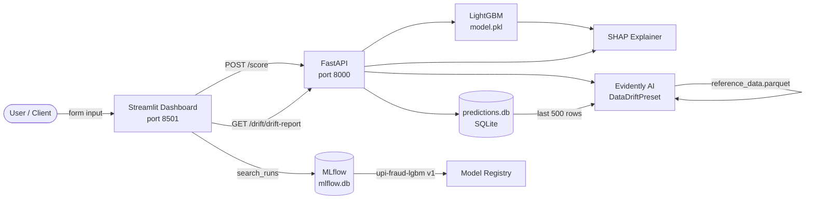

# UPI Fraud Detection — Production MLOps Pipeline


End-to-end MLOps pipeline for real-time UPI transaction fraud detection — featuring drift monitoring, SHAP explainability, and MLflow experiment tracking.

---

## Architecture



---

## Quick Start

```bash
git clone https://github.com/RohitRathod0/Upi-Fraud-detection.git
cd Upi-Fraud-detection/upi-fraud-mlops
pip install -r requirements.txt
docker-compose up --build
```

Services start at:
| Service | URL |
|---------|-----|
| FastAPI | http://localhost:8000/docs |
| Streamlit | http://localhost:8501 |
| MLflow UI | http://localhost:5001 |

---

## API Reference

| Method | Endpoint | Description |
|--------|----------|-------------|
| `POST` | `/score` | Score a transaction → fraud probability + SHAP top-3 |
| `GET` | `/drift/drift-report` | JSON drift summary (cached 1 hr) |
| `GET` | `/drift/drift-report/html` | Full Evidently HTML report download |
| `GET` | `/drift/drift-report/status` | Lightweight status: `ok / warning / critical` |
| `GET` | `/health` | Model version + API liveness |

---

## AWS EC2 Deployment

An automated deployment script is provided to spin up the entire stack on an AWS EC2 instance (Ubuntu).

1. Launch an Ubuntu EC2 instance.
2. In your AWS Security Group, open inbound ports: **8000** (FastAPI), **8501** (Streamlit), **5001** (MLflow), and **22** (SSH).
3. SSH into your instance, clone this repository, and run the deployment script:

```bash
git clone https://github.com/RohitRathod0/Upi-Fraud-detection.git
cd Upi-Fraud-detection/upi-fraud-mlops
chmod +x deploy_ec2.sh
./deploy_ec2.sh
```

---

## Project Structure

```
upi-fraud-mlops/
├── api/               # FastAPI app + drift router
├── src/               # Feature pipeline, training, evaluation, MLflow utils
├── monitoring/        # Standalone drift CLI + alerts log
├── dashboard/         # Streamlit multi-tab UI
├── data/              # Raw CSV, reference parquet, predictions DB, drift reports
├── models/            # model.pkl, pipeline.pkl
├── docker/            # Dockerfiles for API and dashboard
└── docker-compose.yml
```

---


