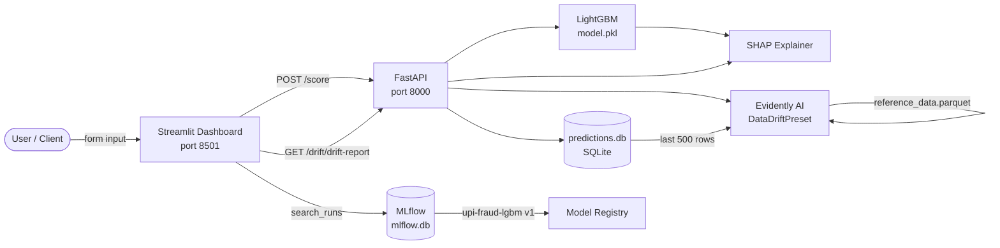

# UPI Fraud Detection — Production MLOps Pipeline


End-to-end MLOps pipeline for real-time UPI transaction fraud detection — featuring drift monitoring, SHAP explainability, and MLflow experiment tracking.

---

## Architecture



---

## Quick Start

```bash
git clone https://github.com/RohitRathod0/Upi-Fraud-detection.git
cd Upi-Fraud-detection/upi-fraud-mlops
pip install -r requirements.txt
docker-compose up --build
```

Services start at:
| Service | URL |
|---------|-----|
| FastAPI | http://localhost:8000/docs |
| Streamlit | http://localhost:8501 |
| MLflow UI | http://localhost:5000 |

---

## API Reference

| Method | Endpoint | Description |
|--------|----------|-------------|
| `POST` | `/score` | Score a transaction → fraud probability + SHAP top-3 |
| `GET` | `/drift/drift-report` | JSON drift summary (cached 1 hr) |
| `GET` | `/drift/drift-report/html` | Full Evidently HTML report download |
| `GET` | `/drift/drift-report/status` | Lightweight status: `ok / warning / critical` |
| `GET` | `/health` | Model version + API liveness |

---

## Project Structure

```
upi-fraud-mlops/
├── api/               # FastAPI app + drift router
├── src/               # Feature pipeline, training, evaluation, MLflow utils
├── monitoring/        # Standalone drift CLI + alerts log
├── dashboard/         # Streamlit multi-tab UI
├── data/              # Raw CSV, reference parquet, predictions DB, drift reports
├── models/            # model.pkl, pipeline.pkl
├── docker/            # Dockerfiles for API and dashboard
└── docker-compose.yml
```

---

## Resume Bullets

- Built a production-grade UPI fraud detection pipeline with LightGBM (PR-AUC 0.917) by engineering 14 balance-consistency features and tuning with Optuna, resulting in 84% recall at 0.3 threshold on 6M+ PaySim transactions
- Implemented real-time data drift monitoring with Evidently AI by comparing live prediction distributions against a 10K stratified reference set, resulting in a FastAPI `/drift-report` endpoint with 1-hour caching and `ok/warning/critical` alerting
- Integrated SHAP explainability into a FastAPI serving layer by loading a TreeExplainer at startup and returning top-3 feature contributions per prediction, enabling auditable fraud decisions in production
- Containerized the full MLOps stack (FastAPI + Streamlit + MLflow) using Docker Compose with isolated networking, achieving one-command deployment and reproducible environments across dev and production
